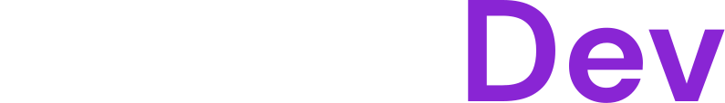
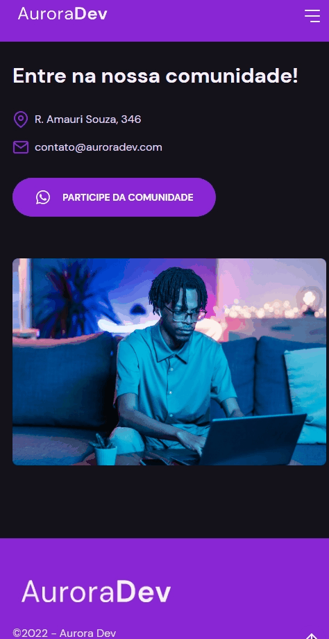
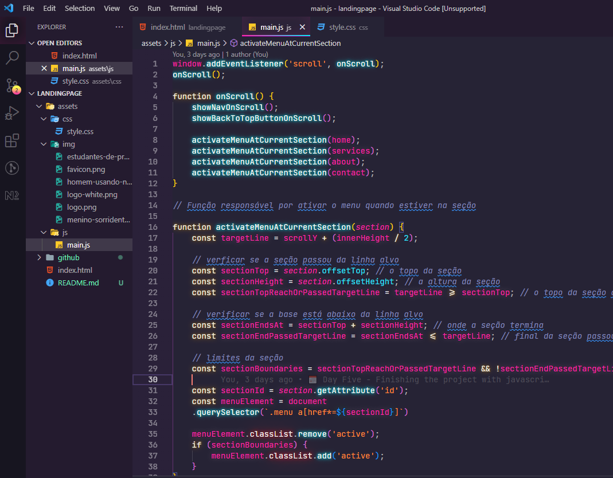

<h1 align="center">
    
</h1>

    <h3> 🟣 BOAS-VINDAS A AURORADEV 👋 🟣 </h3>
    
    
     
    
    

# AuroraDev

A AuroraDev é um projeto realizado na Next Level Week Return da Rocketseat com intuito de criar uma landing page responsiva e personalizável. Escolhi a Trilha Origin, onde vimos conceitos importantes de HTML, CSS e JavaScript.

  

# 🔨 Tecnologias

💻 HTML

💻 CSS

💻 JavaScript

## :camera: Veja:

### Aplicação

### Código:

## 🔖 Layout

Você pode visualizar o layout do projeto através [desse link](https://www.figma.com/community/file/1102912263666619803). É necessário ter conta no [Figma](https://figma.com) para acessá-lo.

## :infinity: Ajuda da Rocketseat

A ajuda das aulas disponibilizadas durante a semana e a comunidade da Rocketseat foram essenciais para que eu chegasse no final do projeto. Deixo também meus agradecimentos ao professor **Mayk Brito**.
[Venha e participe da próxima NLW!!!](https://discord.gg/YxU7fJT)
